<div align="center">
  

  <br />

  <a href="https://git.io/typing-svg">
    
  </a>

  <br />

  <a href="https://porfolio-rho-blush.vercel.app"></a>
  <a href="https://www.linkedin.com/in/praful-athrangadan-058285376"></a>
  <a href="mailto:praful.edx@gmail.com"></a>
  
</div>

<br />

## `01 // HELLO, WORLD`

I’m **Praful** — a Computer Science student who likes turning emerging technology into products people can actually use. I build across **web, AI, blockchain, and product engineering**, with a soft spot for thoughtful interfaces and privacy-first experiences.

```ts
const praful = {
  mindset: "learn deeply, build boldly, polish relentlessly",
  currentlyBuilding: ["consumer products", "AI tools", "interactive web experiences"],
  caresAbout: ["privacy", "clarity", "performance", "craft"],
  openTo: "interesting problems and ambitious collaborations",
};
```

## `02 // TOOLBOX`

<div align="center">
  
</div>

<br />

<div align="center">
  
  
  
  
  
</div>

## `03 // FEATURED BUILDS`

<table>
  <tr>
    <td width="50%" valign="top">
      <h3>◈ HUSTI</h3>
      <p>A private, offline-first savings calendar that turns consistency into a visible daily habit—with no account and no cloud dependency.</p>
      <p><code>JavaScript</code> <code>PWA</code> <code>Local-first</code> <code>Vite</code></p>
      <a href="https://husti-open.vercel.app"><b>Live experience ↗</b></a> · <a href="https://github.com/Praful-7723/husti-open">Source</a>
    </td>
    <td width="50%" valign="top">
      <h3>◈ Algo Arcade</h3>
      <p>A neon maze arcade where players race routes, compare DFS, BFS and A* solvers, then challenge friends with shareable rooms.</p>
      <p><code>React</code> <code>TypeScript</code> <code>Supabase</code> <code>Motion</code></p>
      <a href="https://aa-algo-arcade.vercel.app"><b>Play live ↗</b></a> · <a href="https://github.com/Praful-7723/AA-algo-arcade">Source</a>
    </td>
  </tr>
  <tr>
    <td width="50%" valign="top">
      <h3>◈ Mood Pomodoro</h3>
      <p>A mood-aware focus timer combining a polished frontend, Java backend, and Python-powered analytics.</p>
      <p><code>Java</code> <code>Spring Boot</code> <code>Python</code> <code>JavaScript</code></p>
      <a href="https://github.com/Praful-7723/mood-pomodoro"><b>Explore repository ↗</b></a>
    </td>
    <td width="50%" valign="top">
      <h3>◈ Background Remover AI</h3>
      <p>A fast image workflow that removes backgrounds with deep learning and exports clean transparent PNGs.</p>
      <p><code>Python</code> <code>Flask</code> <code>rembg</code> <code>AI</code></p>
      <a href="https://github.com/Praful-7723/background-remover-ai"><b>Explore repository ↗</b></a>
    </td>
  </tr>
</table>

<div align="center">
  <a href="https://github.com/Praful-7723/society-maintenance-app">
    
  </a>
</div>

## `04 // SIGNALS`

<div align="center">
  <picture>
    <source media="(prefers-color-scheme: dark)" srcset="https://github-readme-stats.vercel.app/api?username=Praful-7723&show_icons=true&include_all_commits=true&hide_border=true&bg_color=00000000&title_color=A78BFA&text_color=CBD5E1&icon_color=F8C15C&ring_color=8B5CF6" />
    <source media="(prefers-color-scheme: light)" srcset="https://github-readme-stats.vercel.app/api?username=Praful-7723&show_icons=true&include_all_commits=true&hide_border=true&bg_color=00000000&title_color=6D28D9&text_color=334155&icon_color=D97706&ring_color=7C3AED" />
    
  </picture>
  <picture>
    <source media="(prefers-color-scheme: dark)" srcset="https://streak-stats.demolab.com?user=Praful-7723&hide_border=true&background=00000000&ring=A78BFA&fire=F8C15C&currStreakLabel=A78BFA&sideLabels=CBD5E1&dates=64748B&currStreakNum=F8FAFC&sideNums=F8FAFC" />
    <source media="(prefers-color-scheme: light)" srcset="https://streak-stats.demolab.com?user=Praful-7723&hide_border=true&background=00000000&ring=7C3AED&fire=D97706&currStreakLabel=6D28D9&sideLabels=334155&dates=64748B&currStreakNum=0F172A&sideNums=0F172A" />
    
  </picture>
</div>

<br />

<picture>
  <source media="(prefers-color-scheme: dark)" srcset="https://raw.githubusercontent.com/Praful-7723/Praful-7723/output/github-contribution-grid-snake-dark.svg" />
  <source media="(prefers-color-scheme: light)" srcset="https://raw.githubusercontent.com/Praful-7723/Praful-7723/output/github-contribution-grid-snake.svg" />
  
</picture>

## `05 // FIND ME`

<div align="center">
  <p><b>Have a difficult problem, an unusual idea, or something worth building?</b></p>
  <p>
    <a href="https://porfolio-rho-blush.vercel.app">Portfolio</a>
    &nbsp;·&nbsp;
    <a href="mailto:praful.edx@gmail.com">Email</a>
    &nbsp;·&nbsp;
    <a href="https://www.linkedin.com/in/praful-athrangadan-058285376">LinkedIn</a>
    &nbsp;·&nbsp;
    <a href="https://github.com/Praful-7723?tab=repositories">All repositories</a>
  </p>
  <sub>Build with intent. Ship with care. Keep refining.</sub>
</div>
