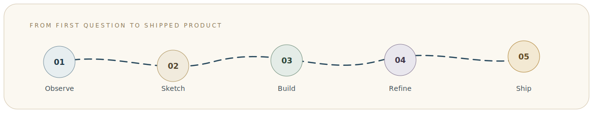
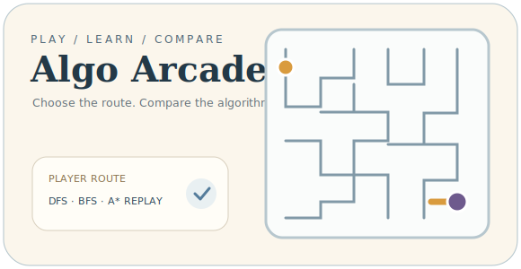

  
  

   

  
  
  

 

## `01 / THE MAKER`

> **I turn emerging technology into products people can actually use.**

I’m **Praful**, a Computer Science student building across **product engineering, AI, blockchain, and the web**. I care about the quiet details: whether an interaction feels obvious, whether data stays private, whether a product earns its complexity, and whether the finished experience feels intentional.

<table>
  <tr>
    <td width="33%" valign="top">
      <b>✦ How I think</b>  
      Start with the human problem. Let technology earn its place.
    </td>
    <td width="33%" valign="top">
      <b>✦ How I build</b>  
      Prototype quickly, question assumptions, refine relentlessly.
    </td>
    <td width="33%" valign="top">
      <b>✦ What I value</b>  
      Clarity, privacy, performance, accessibility, and craft.
    </td>
  </tr>
</table>

## `02 / THE TOOL CABINET`

  LANGUAGES  
  
    
  PRODUCT ENGINEERING  
  
    
  DATA, DELIVERY &amp; CRAFT  
  

 

  
  
  

## `03 / SELECTED WORK`

<table>
  <tr>
    <td width="50%" valign="top">
      
      <h3>HUSTI · Offline Savings PWA</h3>
      
A private savings calendar that turns consistency into a daily ritual—without accounts, cloud storage, or subscription friction.

      
<b>Why it exists:</b> Financial habits should be easy to begin and private by default.

      
<code>JavaScript</code> <code>PWA</code> <code>Local Storage</code> <code>Vite</code>

      <a href="https://husti-open.vercel.app"><b>Experience it live ↗</b></a> · <a href="https://github.com/Praful-7723/husti-open">Source</a>
    </td>
    <td width="50%" valign="top">
      
      <h3>Algo Arcade · Algorithm Maze Game</h3>
      
A neon maze arcade where players choose routes, compare DFS, BFS and A* replays, and challenge friends.

      
<b>Why it exists:</b> Algorithms become memorable when the learner controls the path.

      
<code>React</code> <code>TypeScript</code> <code>Supabase</code> <code>Motion</code>

      <a href="https://aa-algo-arcade.vercel.app"><b>Play it live ↗</b></a> · <a href="https://github.com/Praful-7723/AA-algo-arcade">Source</a>
    </td>
  </tr>
</table>

### `Workbench shelf`

| Build | What it explores | Materials |
|---|---|---|
| [**Mood Pomodoro**](https://github.com/Praful-7723/mood-pomodoro) | Mood-aware focus sessions with analytical feedback | Java, Spring Boot, Python, JavaScript |
| [**Background Remover AI**](https://github.com/Praful-7723/background-remover-ai) | Fast before/after image processing and transparent exports | Python, Flask, rembg |
| [**Society Maintenance App**](https://github.com/Praful-7723/society-maintenance-app) | Billing, payment proof, approvals, reminders and community administration | Java, Maven, Web UI |
| [**Solana NFT Page**](https://github.com/Praful-7723/solona--nFt-page) | Responsive Web3 product presentation and minting flows | Next.js, TypeScript, Tailwind CSS |

## `04 / NOTES FROM THE BUILD`

<table>
  <tr>
    <td width="33%" valign="top">
      <b>01 · Privacy without ceremony</b>  
      HUSTI keeps financial records on-device. The product begins immediately instead of beginning with registration.
    </td>
    <td width="33%" valign="top">
      <b>02 · Learning through agency</b>  
      Algo Arcade lets players choose first and compare later. The explanation arrives after genuine curiosity.
    </td>
    <td width="33%" valign="top">
      <b>03 · Interfaces should explain themselves</b>  
      Clear states, useful motion and focused hierarchy reduce the amount of instruction a product needs.
    </td>
  </tr>
</table>

### `Now / Next / Later`

| NOW | NEXT | LATER |
|:---|:---|:---|
| Refining shipped products and their smallest interactions | Building more useful AI-assisted workflows | Collaborating on ambitious products with thoughtful people |

## `05 / QUIET SIGNALS`

<i>Activity is context—not the headline. The work comes first.</i>

  <picture>
    <source media="(prefers-color-scheme: dark)" srcset="https://github-readme-stats.vercel.app/api?username=Praful-7723&show_icons=true&hide_border=true&bg_color=00000000&title_color=D6B36D&text_color=D1D5DB&icon_color=7FA1B4&ring_color=D6B36D" />
    <source media="(prefers-color-scheme: light)" srcset="https://github-readme-stats.vercel.app/api?username=Praful-7723&show_icons=true&hide_border=true&bg_color=00000000&title_color=27485C&text_color=59666E&icon_color=B58D45&ring_color=6F8FA3" />
    
  </picture>

<picture>
  <source media="(prefers-color-scheme: dark)" srcset="https://raw.githubusercontent.com/Praful-7723/Praful-7723/output/github-contribution-grid-snake-dark.svg" />
  <source media="(prefers-color-scheme: light)" srcset="https://raw.githubusercontent.com/Praful-7723/Praful-7723/output/github-contribution-grid-snake.svg" />
  
</picture>

## `06 / AN OPEN DOOR`

  <h3>The next repository could begin with a conversation.</h3>
  

    <a href="https://porfolio-rho-blush.vercel.app"><b>Portfolio</b></a>
    &nbsp;·&nbsp;
    <a href="mailto:praful.edx@gmail.com"><b>Email</b></a>
    &nbsp;·&nbsp;
    <a href="https://www.linkedin.com/in/praful-athrangadan-058285376"><b>LinkedIn</b></a>
    &nbsp;·&nbsp;
    <a href="https://github.com/Praful-7723?tab=repositories"><b>Repositories</b></a>
  

  Observe carefully · Build deliberately · Ship with care

